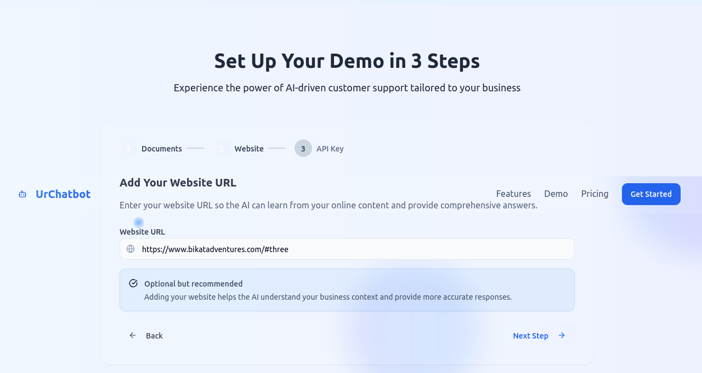
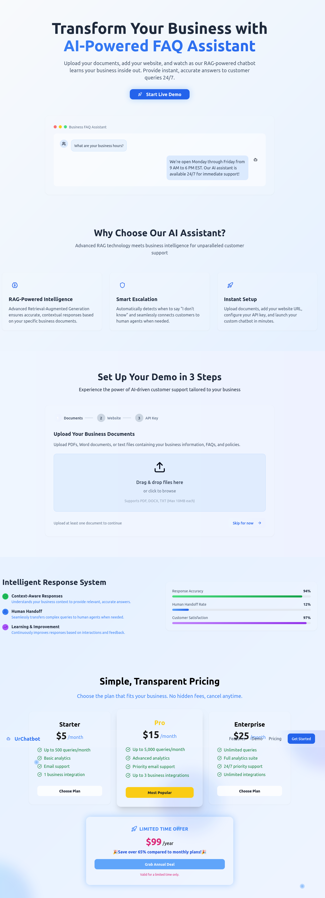
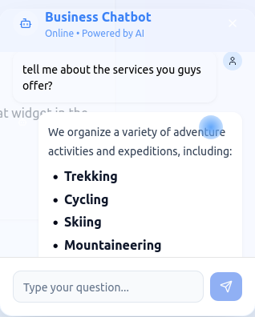

# UrChatBot

UrChatBot is a business-ready AI chatbot platform that leverages RAG (Retrieval-Augmented Generation) and Gemini API to answer business FAQs, resolve client queries, and escalate to human agents when needed. Users can upload documents, provide a website link, and use their own Gemini API key to tailor the chatbot to their business context.

---

## Features

- **RAG-powered AI Chatbot**: Answers questions using your business docs and website.
- **Gemini API Integration**: Bring your own Gemini API key.
- **Smart Escalation**: Knows when to say "I don't know" and offers human handoff.
- **Document & Website Upload**: Supports PDF, DOCX, TXT, and website crawling.
- **Animated, Responsive UI**: Modern design with blue accents and custom cursor.
- **Transparent Pricing**: Three monthly tiers and a special annual offer.

---

## Screenshots

### Setup Wizard




### Chatbot Demo




## Getting Started

### Prerequisites

- [Node.js](https://nodejs.org/) (v18+ recommended)
- [npm](https://www.npmjs.com/)
- [PostgreSQL](https://www.postgresql.org/) (if using production DB)
- Gemini API Key (get from Google AI Studio)

### 1. Clone the Repository

```bash
git clone https://github.com/yourusername/urchatbot.git
cd urchatbot
```

### 2. Install Dependencies

```bash
cd client
npm install
cd ../server
npm install
```

### 3. Configure Environment Variables

Create a `.env` file in the `server` directory:

```env
DATABASE_URL=your_postgres_connection_string
GEMINI_API_KEY=your_gemini_api_key
```

### 4. Run the Server

```bash
cd server
npm run dev
```

### 5. Run the Client

```bash
cd ../client
npm run dev
```

The client will be available at [http://localhost:5173](http://localhost:5173) (or your configured port).

---

## Usage

1. Open the web app in your browser.
2. Use the setup wizard to upload documents, enter your website, and provide your Gemini API key.
3. Click "Start Chatting" to open the chat widget.
4. Ask business-related questions and get instant, context-aware answers.

---

## License

MIT License

---

## Credits

- Built with [Next.js](https://nextjs.org/), [Tailwind CSS](https://tailwindcss.com/), [Framer Motion](https://www.framer.com/motion/), and [Google Gemini API](https://ai.google.dev/).
